# HireNext — Software Architecture Document

> **Generated from codebase analysis. Every statement is backed by actual implementation.**
> Last updated: June 2026

---

## Table of Contents

1. [Project Overview](#1-project-overview)
2. [High-Level Architecture](#2-high-level-architecture)
3. [Component Diagram](#3-component-diagram)
4. [Request Flow Diagrams](#4-request-flow-diagrams)
5. [Database Architecture](#5-database-architecture)
6. [API Architecture](#6-api-architecture)
7. [Authentication Flow](#7-authentication-flow)
8. [WebSocket Architecture](#8-websocket-architecture)
9. [AI Architecture](#9-ai-architecture)
10. [Data Flow Diagram](#10-data-flow-diagram)
11. [Folder Architecture](#11-folder-architecture)
12. [Dependency Graph](#12-dependency-graph)
13. [Deployment Architecture](#13-deployment-architecture)
14. [Security Architecture](#14-security-architecture)
15. [Performance Architecture](#15-performance-architecture)
16. [External Services](#16-external-services)
17. [Environment Variables](#17-environment-variables)
18. [Architecture Summary](#18-architecture-summary)

---

## 1. Project Overview

HireNext is an AI-powered interview platform that enables recruiters to create interview sessions, generate AI-tailored questions, conduct voice-based interviews with an AI interviewer (via Vapi), and provide real-time collaborative code editing for technical interviews. The system generates automated feedback and analytics for each candidate.

The project is a monorepo with two deployable units:

- **`web/`** — Next.js 16 frontend + API routes (recruiter dashboard, candidate interview UI, AI services)
- **`ws-server/`** — Standalone Node.js WebSocket server (real-time collaborative editor, code execution, room state)

---

## 2. High-Level Architecture

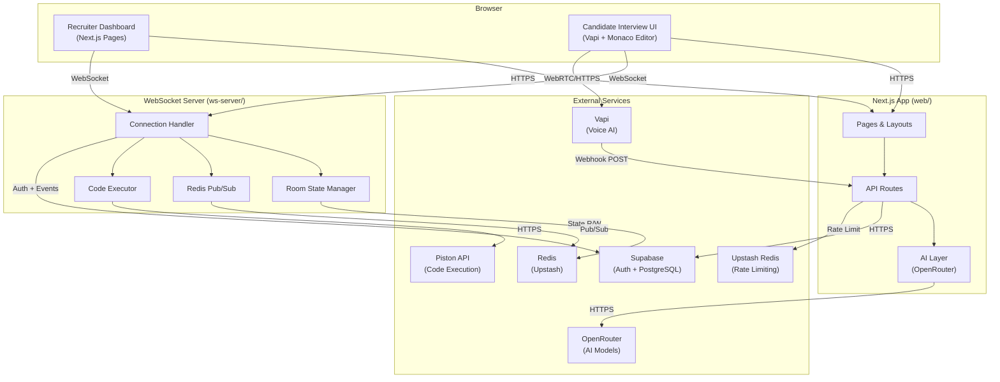

---

## 3. Component Diagram

### Frontend Components

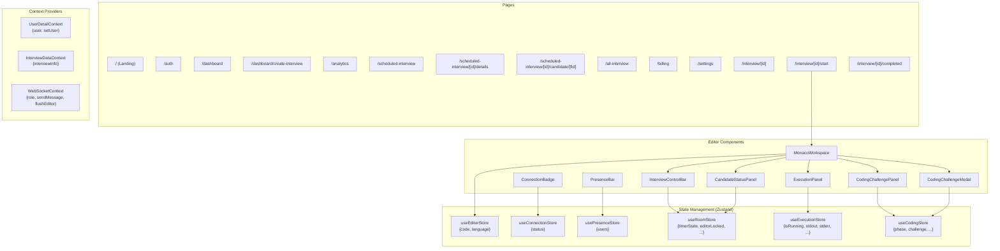

### Backend Components (WebSocket Server)

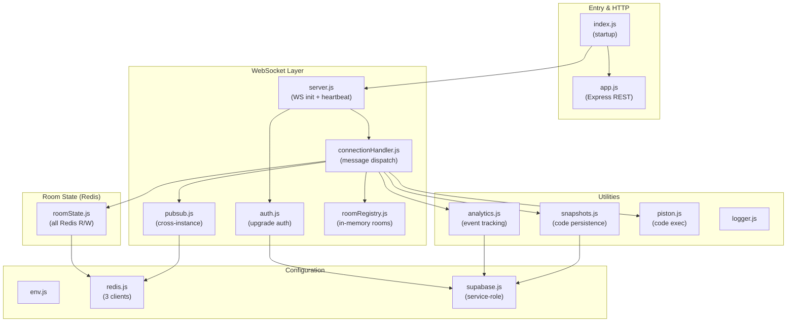

---

## 4. Request Flow Diagrams

### 4.1 User Login

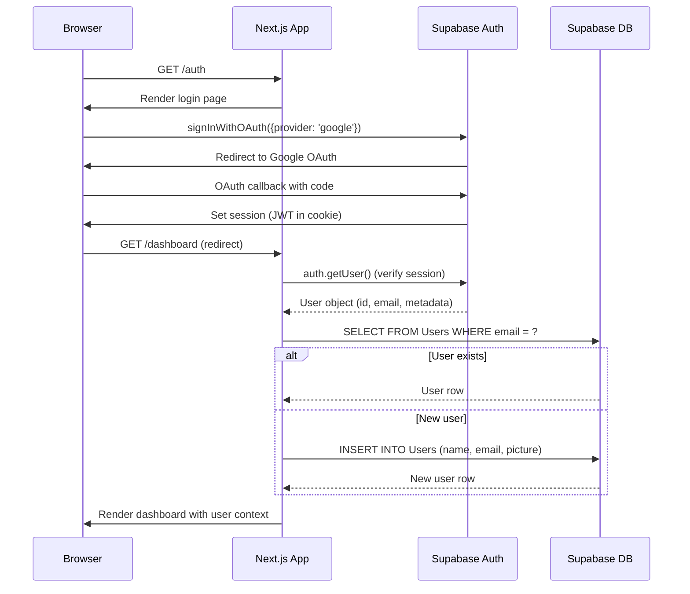

### 4.2 Interview Creation

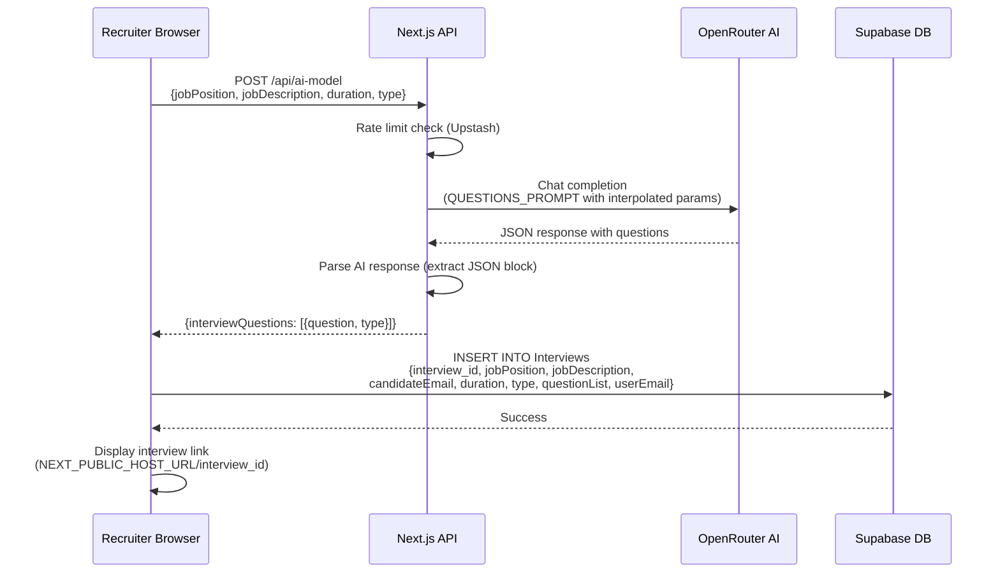

### 4.3 Interview Session (Technical)

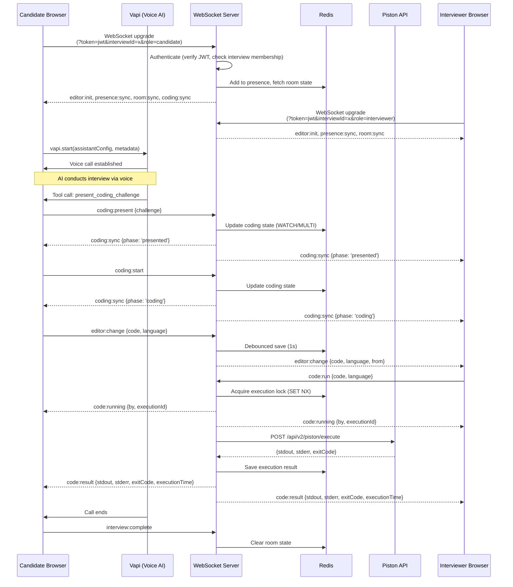

### 4.4 AI Feedback Generation

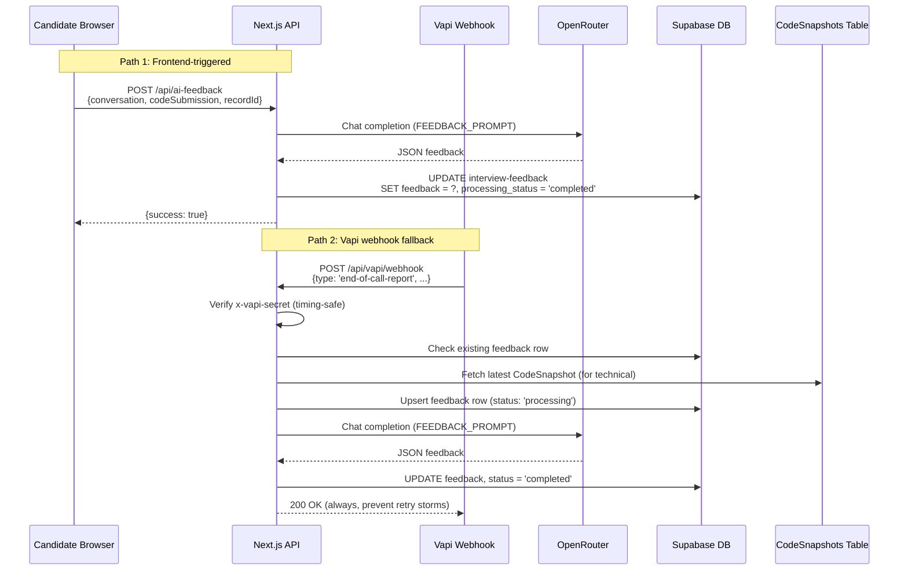

---

## 5. Database Architecture

All data is stored in Supabase (PostgreSQL). The following schema is derived from actual queries in the codebase.

### Entity Relationship Diagram

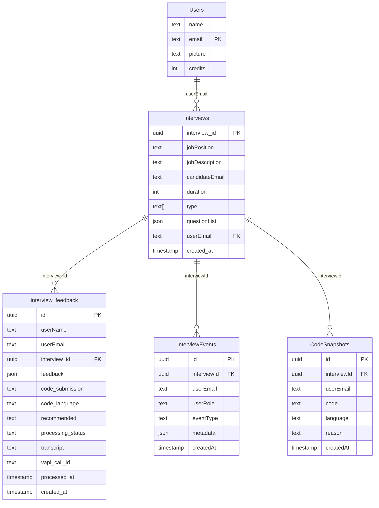

### Table Details

**Users** — Recruiter accounts. Provisioned on first Google OAuth login. `credits` field used to gate interview creation.

**Interviews** — Created by recruiters. `type` is an array (e.g., `["Technical"]` or `["Behavioral", "Experience"]`). `questionList` stores AI-generated questions as JSON. `userEmail` is the recruiter, `candidateEmail` is the invitee.

**interview-feedback** — One row per candidate per interview. `processing_status` follows a state machine: `pending` → `processing` → `completed` | `failed`. `feedback` is a JSON object with `rating` (4 scores out of 10), `summary`, `recommendation`, `recommendationMsg`.

**InterviewEvents** — Telemetry written by the WebSocket server. Tracks join/leave, timer events, code execution, editor lock/unlock, coding challenges.

**CodeSnapshots** — Written by the WebSocket server at key moments: Interview Started, Interview Ended, Execution Succeeded, WebSocket Disconnected, WebSocket Error. Used by the Vapi webhook to recover code submissions.

### Important Constraints

- `interview-feedback` is joined to `Interviews` via `interview_id` foreign key (PostgREST syntax: `interview-feedback(*)`)
- Duplicate candidate submissions are checked client-side: query `interview-feedback` for matching `(interview_id, userEmail)` before allowing entry
- `InterviewEvents` table may not exist in all environments — the WS server handles `42P01` (table not found) gracefully
- No explicit indexes are defined in the codebase (managed by Supabase/PostgreSQL defaults)

---

## 6. API Architecture

### Next.js API Routes

| Method | Route | Auth | Rate Limited | Purpose | Service Called | DB Tables |
|--------|-------|------|-------------|---------|---------------|-----------|
| POST | `/api/ai-model` | None (public) | Yes (Upstash) | Generate interview questions | OpenRouter AI | None |
| POST | `/api/ai-feedback` | None (uses service key) | No | Generate candidate feedback | OpenRouter AI | `interview-feedback` |
| GET | `/api/interviews` | Bearer token (`verifyUser`) | No | Paginated interview list | Supabase | `Interviews`, `interview-feedback` |
| GET | `/api/analytics/kpis` | Bearer token (`verifyUser`) | No | Dashboard KPI metrics | Supabase | `Interviews`, `interview-feedback` |
| GET | `/api/analytics/candidates` | Bearer token (`verifyUser`) | No | Candidate feed with pagination | Supabase | `interview-feedback`, `Interviews` |
| POST | `/api/vapi/webhook` | `x-vapi-secret` header (HMAC) | No | End-of-call report processing | OpenRouter AI, Supabase | `interview-feedback`, `CodeSnapshots`, `Interviews` |
| GET | `/api/debug/analytics` | Env flag gate | No | Diagnostics & health check | Supabase, OpenRouter | Multiple |

### WebSocket Server REST Endpoints

| Method | Route | Auth | Purpose | Data Source |
|--------|-------|------|---------|-------------|
| GET | `/health` | None | Health check (Redis ping, memory, uptime) | Redis |
| GET | `/api/interviews/:id/timeline` | Bearer token | Interview event timeline | `InterviewEvents` (Supabase) |
| GET | `/api/interviews/:id/code` | Bearer token | Current editor document | Redis (`room:{id}:doc`) |
| GET | `/api/interviews/:id/analytics` | Bearer token (interviewer only) | Computed interview analytics | `InterviewEvents` (Supabase) |

### Detailed API: POST `/api/ai-model`

**Request:**
```json
{
  "jobPosition": "Senior Frontend Engineer",
  "jobDescription": "Build React applications...",
  "interviewDuration": 30,
  "interviewType": ["Technical"]
}
```

**Response:**
```json
{
  "interviewQuestions": [
    { "question": "Explain React's reconciliation algorithm...", "type": "Technical" }
  ]
}
```

### Detailed API: POST `/api/ai-feedback`

**Request:**
```json
{
  "conversation": [{"role": "assistant", "content": "..."}],
  "codeSubmission": "function solve() {...}",
  "codeLanguage": "javascript",
  "recordId": "uuid"
}
```

**Response:**
```json
{
  "success": true,
  "feedback": {
    "rating": { "technicalSkills": 8, "communication": 7, "problemSolving": 6, "experience": 7 },
    "summary": "...",
    "recommendation": "Hire",
    "recommendationMsg": "..."
  }
}
```

### Detailed API: GET `/api/interviews`

**Query Parameters:** `search`, `type`, `sort` (newest|oldest|alphabetical|candidates), `cursor_id`, `cursor_date`, `cursor_val`, `limit` (default 10)

**Response:**
```json
{
  "items": [{ "interview_id": "...", "jobPosition": "...", "interview-feedback": [...] }],
  "hasMore": true,
  "nextCursor": { "id": "...", "date": "...", "val": "..." },
  "totalCount": 42
}
```

---

## 7. Authentication Flow

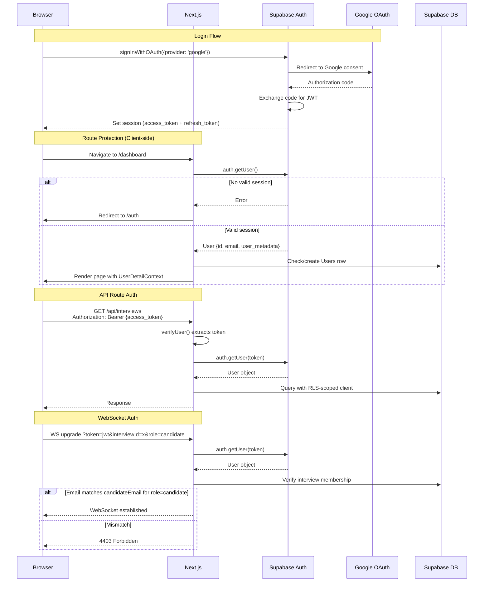

### Token Lifecycle

- **Access Token**: JWT issued by Supabase Auth, short-lived (configurable in Supabase, typically 1 hour)
- **Refresh Token**: Long-lived, stored in browser by Supabase client SDK
- **Auto-refresh**: Supabase JS client auto-refreshes tokens before expiry
- **Logout**: `supabase.auth.signOut()` clears local session; `(main)/layout.js` listens to `onAuthStateChange` for `SIGNED_OUT` events and redirects to `/auth`

### Auth Provider

Google OAuth is the only authentication method. There is no email/password, magic link, or other provider configured.

---

## 8. WebSocket Architecture

### Connection Lifecycle

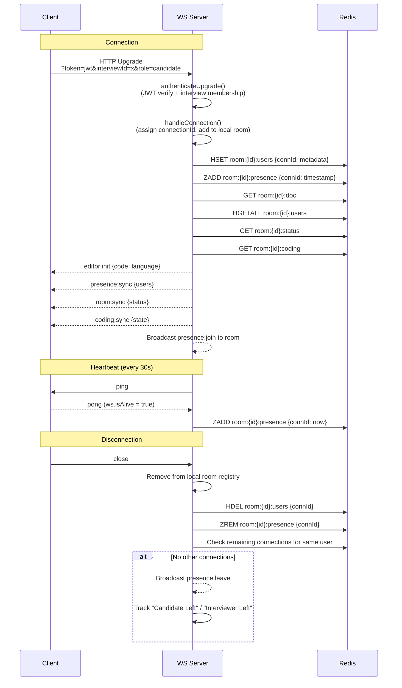

### Event Flow

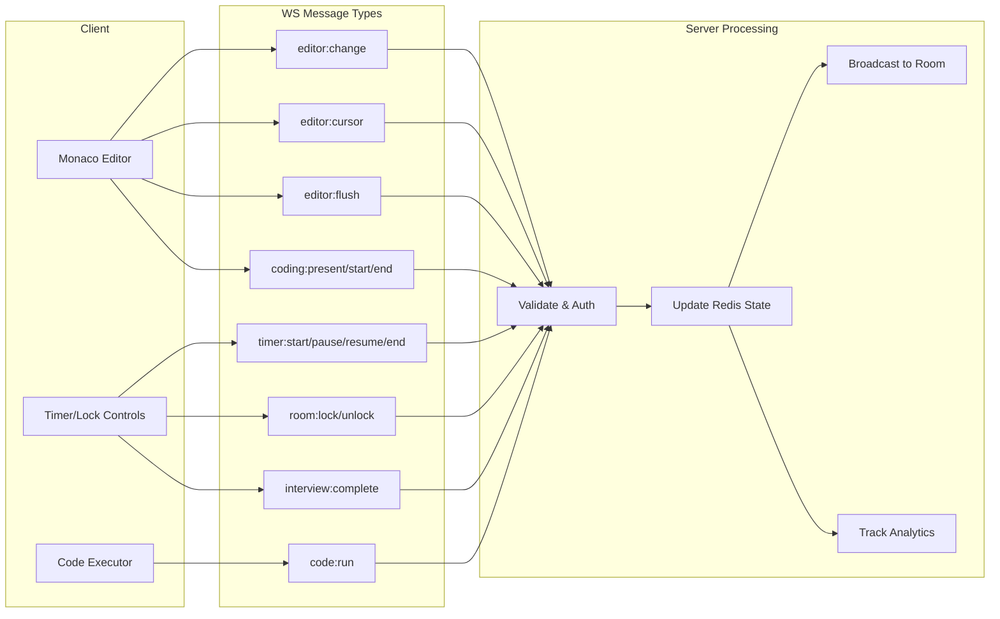

### Redis Pub/Sub for Cross-Instance Broadcasting

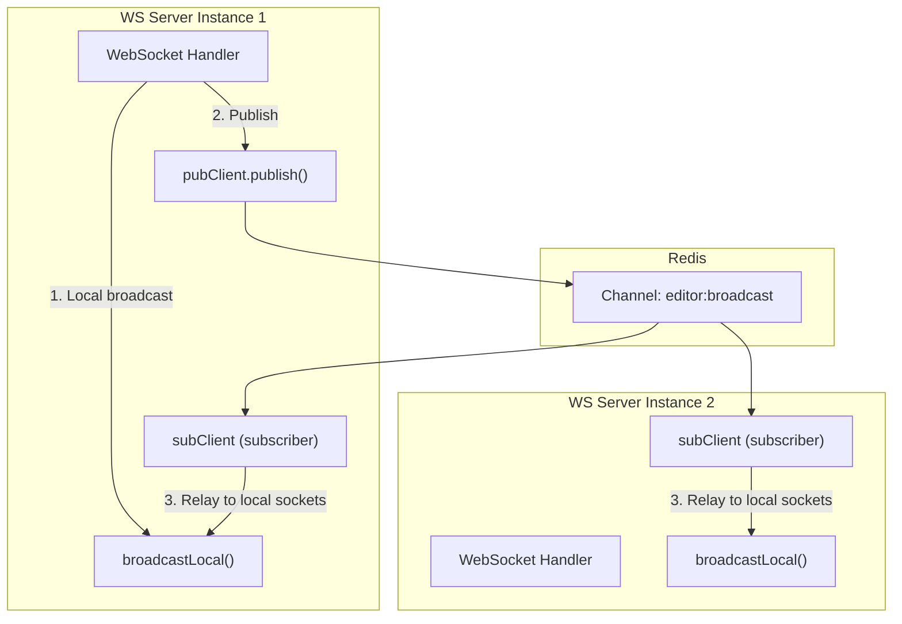

### Redis Key Schema

| Key Pattern | Redis Type | TTL | Purpose |
|---|---|---|---|
| `room:{id}:doc` | STRING (JSON) | 6 hours | Editor document `{code, language, updatedAt}` |
| `room:{id}:status` | STRING (JSON) | 6 hours | Room state `{interviewStatus, timerState, startedAt, pausedAt, elapsedTime, editorLocked}` |
| `room:{id}:coding` | STRING (JSON) | 6 hours | Coding challenge `{phase, challenge, startedAt}` |
| `room:{id}:executionResult` | STRING (JSON) | 6 hours | Last execution result |
| `room:{id}:executionLock` | STRING | 30 seconds | Distributed mutex for code execution |
| `room:{id}:users` | HASH | 6 hours | Connection metadata (field=connId, value=JSON) |
| `room:{id}:presence` | ZSET | 6 hours | Active connections (member=connId, score=timestamp) |

### Reconnection Strategy (Client)

- Exponential backoff: 2^n seconds, max 30 seconds
- Auto-reconnects on unexpected close
- Listens to browser `online` event for immediate reconnect
- Listens to `visibilitychange` to reconnect when tab becomes visible

---

## 9. AI Architecture

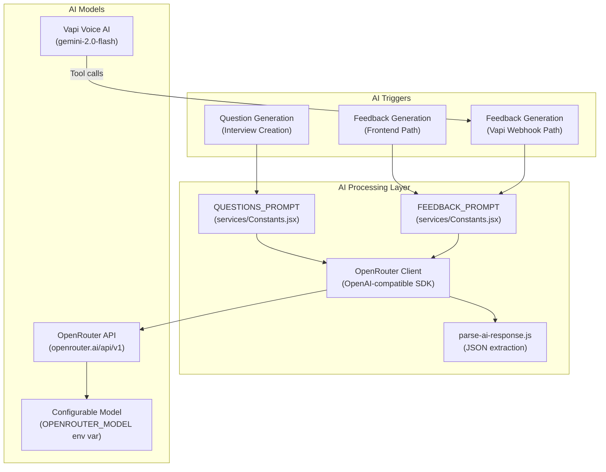

### AI Providers

| Provider | Model | Purpose | Where Used |
|---|---|---|---|
| OpenRouter | Configurable via `OPENROUTER_MODEL` (default: `nvidia/nemotron-3-super-120b-a12b:free`) | Question generation & feedback | `lib/ai/openrouter.js` |
| Vapi (Google) | `gemini-2.0-flash` | Voice AI interviewer | `app/interview/[id]/start/page.jsx` |

### Prompt Engineering

**Question Generation (`QUESTIONS_PROMPT`)**: Role-aware, seniority-aware, technology-specific prompts with strict rules separating Technical vs non-Technical interview types. Includes a self-check instruction to remove coding questions from non-Technical interviews.

**Feedback Generation (`FEEDBACK_PROMPT`)**: Takes conversation transcript + code submission. Rates 4 dimensions (technicalSkills, communication, problemSolving, experience) out of 10. Evaluates code for correctness, complexity, readability, error handling.

### Response Parsing

`parse-ai-response.js` extracts the first `{...}` JSON block from the AI's text response using regex. This handles cases where the model wraps JSON in markdown code blocks or adds explanatory text.

### Vapi Tool Calls (Technical Interviews)

Two function tools are registered with the Vapi assistant for Technical interviews:

1. **`present_coding_challenge`**: Parameters: `title` (string), `description` (string), `difficulty` (Easy/Medium/Hard), `timeLimit` (number, seconds). When the AI decides to present a coding challenge, it emits this tool call, which the frontend forwards to the WebSocket server.

2. **`end_coding_challenge`**: No parameters. Ends the active coding round.

### Error Handling & Retry

- OpenRouter calls have no explicit retry logic in the application code
- Vapi webhook always returns HTTP 200 to prevent retry storms
- `generateFeedback()` failures set `processing_status = 'failed'` in the database
- Analytics event tracking has 3 retries with exponential backoff (1s, 2s, 4s)

---

## 10. Data Flow Diagram

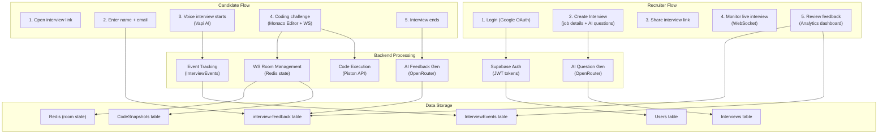

---

## 11. Folder Architecture

```
HireNext/
├── README.md
├── web/                              # Next.js 16 frontend application
│   ├── app/                          # App Router pages and API routes
│   │   ├── layout.js                 # Root layout (fonts, providers, toaster)
│   │   ├── page.js                   # Landing page (3D scene, features)
│   │   ├── provider.jsx              # Root provider (Supabase auth, user provisioning)
│   │   ├── globals.css               # Global styles (Tailwind)
│   │   ├── auth/
│   │   │   └── page.jsx              # Google OAuth login
│   │   ├── (main)/                   # Authenticated recruiter routes
│   │   │   ├── layout.js             # Auth guard + sidebar layout
│   │   │   ├── provider.js           # DashboardProvider (SidebarProvider)
│   │   │   ├── _components/
│   │   │   │   └── AppSidebar.jsx    # Navigation sidebar
│   │   │   ├── dashboard/            # Main dashboard + interview creation
│   │   │   ├── analytics/            # Intelligence Center with charts
│   │   │   ├── scheduled-interview/  # Interview workspace + details + candidate review
│   │   │   ├── all-interview/        # Full interview list
│   │   │   ├── billing/              # Mock billing page
│   │   │   └── settings/             # User settings + logout
│   │   ├── interview/                # Candidate-facing interview flow
│   │   │   ├── layout.jsx            # InterviewDataContext provider
│   │   │   ├── [interview_id]/
│   │   │   │   ├── page.jsx          # Interview lobby (name + email entry)
│   │   │   │   ├── start/
│   │   │   │   │   └── page.jsx      # Core interview (Vapi + Monaco editor)
│   │   │   │   └── completed/
│   │   │   │       └── page.jsx      # Completion screen
│   │   │   └── _components/
│   │   │       └── InterviewHeader.jsx
│   │   └── api/                      # Next.js API routes
│   │       ├── ai-model/route.jsx    # AI question generation
│   │       ├── ai-feedback/route.jsx # AI feedback generation
│   │       ├── interviews/route.jsx  # Paginated interview list
│   │       ├── analytics/            # KPI + candidate analytics endpoints
│   │       ├── vapi/webhook/route.js # Vapi end-of-call webhook
│   │       └── debug/analytics/      # Debug diagnostics
│   ├── components/                   # Reusable components
│   │   ├── Logo.jsx                  # Brand logo
│   │   ├── editor/                   # Code editor components
│   │   │   ├── monaco-workspace.jsx  # Monaco editor with WS sync
│   │   │   ├── interview-control-bar.jsx  # Interviewer timer/lock controls
│   │   │   ├── candidate-status-panel.jsx # Candidate read-only status
│   │   │   ├── execution-panel.jsx   # Code execution output
│   │   │   ├── presence-bar.jsx      # Connected users display
│   │   │   ├── connection-badge.jsx  # WS connection status
│   │   │   ├── coding-challenge-modal.jsx  # Challenge presentation overlay
│   │   │   └── coding-challenge-panel.jsx  # Active challenge timer/details
│   │   └── ui/                       # shadcn/ui primitives
│   ├── context/                      # React contexts
│   │   ├── UserDetailContext.jsx     # Authenticated user state
│   │   └── InterviewDataContext.jsx  # Active interview session state
│   ├── providers/
│   │   └── websocket-provider.jsx    # WebSocket connection provider
│   ├── hooks/
│   │   └── use-mobile.js            # Mobile viewport detection
│   ├── store/                        # Zustand state stores
│   │   ├── use-editor-store.js       # Editor content (code, language)
│   │   ├── use-connection-store.js   # WS connection status
│   │   ├── use-presence-store.js     # Connected users
│   │   ├── use-room-store.js         # Interview room state
│   │   ├── use-execution-store.js    # Code execution state
│   │   └── use-coding-store.js       # Coding challenge state
│   ├── lib/                          # Utility libraries
│   │   ├── ai/
│   │   │   ├── openrouter.js         # OpenRouter client factory
│   │   │   └── parse-ai-response.js  # AI response JSON extractor
│   │   ├── auth/
│   │   │   └── verify-user.js        # API route auth middleware
│   │   ├── feedback/
│   │   │   └── generate-feedback.js  # Feedback generation logic
│   │   ├── websocket/
│   │   │   ├── client.js             # WS client singleton (reconnection)
│   │   │   └── event-registry.js     # WS message → Zustand dispatch
│   │   ├── rate-limit.js             # Upstash rate limiter
│   │   ├── debug/logger.js           # Debug logger
│   │   └── utils.js                  # cn() utility (clsx + tailwind-merge)
│   ├── services/
│   │   ├── Constants.jsx             # Sidebar config, interview types, AI prompts
│   │   └── supabaseClient.js         # Supabase browser client singleton
│   ├── public/                       # Static assets (images)
│   ├── package.json
│   ├── next.config.mjs
│   └── postcss.config.mjs
│
└── ws-server/                        # Standalone WebSocket server
    ├── Dockerfile                    # Multi-stage Node 20 Alpine build
    ├── package.json
    └── src/
        ├── index.js                  # Entry point (startup orchestration)
        ├── app.js                    # Express app (health + REST endpoints)
        ├── config/
        │   ├── env.js                # Environment variable loader + validation
        │   ├── redis.js              # Three Redis client instances
        │   └── supabase.js           # Service-role Supabase client
        ├── ws/
        │   ├── server.js             # WS server init + heartbeat loop
        │   ├── auth.js               # WS upgrade authentication
        │   ├── connectionHandler.js  # All WS message handlers
        │   ├── pubsub.js             # Redis pub/sub cross-instance relay
        │   └── roomRegistry.js       # In-memory room → socket tracking
        ├── rooms/
        │   └── roomState.js          # All Redis state operations
        └── utils/
            ├── analytics.js          # Event tracking to Supabase
            ├── snapshots.js          # Code snapshot persistence
            ├── piston.js             # Piston API client
            └── logger.js             # Structured JSON logger
```

---

## 12. Dependency Graph

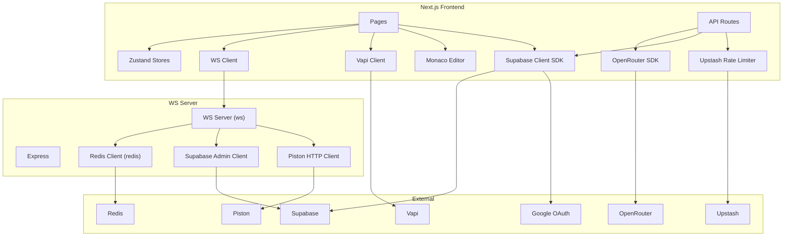

---

## 13. Deployment Architecture

### Docker (WebSocket Server)

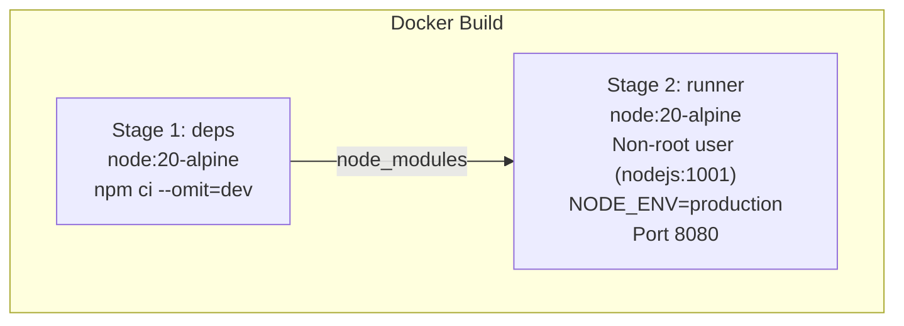

The WebSocket server has a production-ready Dockerfile with multi-stage build. It runs as a non-root user, installs only production dependencies, and exposes port 8080.

### Inferred Deployment Topology

Based on environment configuration and code references:

- **Frontend (Next.js)**: Deployed to **Vercel** (inferred from `CLIENT_ORIGINS` example: `https://your-app.vercel.app` and standard Next.js deployment patterns)
- **WebSocket Server**: Deployed to **Railway** or **Render** (inferred from `.env.example` comments: "Railway/Render inject PORT automatically" and Docker support)
- **Database**: **Supabase** (managed PostgreSQL + Auth)
- **Redis**: **Upstash** (inferred from `UPSTASH_REDIS_REST_URL` for rate limiting; the WS server uses a standard Redis URL which could be Upstash, Railway Redis, or other provider)
- **Code Execution**: **Piston API** (public instance at `emkc.org` or self-hosted)

### CI/CD

Not verifiable from codebase — no `.github/workflows`, `vercel.json`, `render.yaml`, or CI configuration files found.

---

## 14. Security Architecture

### What Exists

| Security Measure | Implementation | Location |
|---|---|---|
| **Authentication** | Supabase Auth with Google OAuth | `app/auth/page.jsx`, `lib/auth/verify-user.js` |
| **JWT Verification** | Server-side token verification via `supabase.auth.getUser()` | `ws-server/src/ws/auth.js`, `lib/auth/verify-user.js` |
| **Role-Based Access** | WebSocket role verification (interviewer vs candidate email matching) | `ws-server/src/ws/auth.js` |
| **Origin Validation** | WS upgrade origin check against allowlist | `ws-server/src/ws/auth.js` |
| **CORS** | Express CORS middleware with explicit origin allowlist | `ws-server/src/app.js` |
| **Rate Limiting** | Upstash Redis-based rate limiting on `/api/ai-model` | `lib/rate-limit.js` |
| **Webhook Auth** | Timing-safe secret comparison for Vapi webhook | `app/api/vapi/webhook/route.js` |
| **Input Validation** | Code execution: language whitelist, 50KB code size limit | `ws-server/src/ws/connectionHandler.js` |
| **Input Sanitization** | Coding challenge: title/description length clamping, difficulty whitelist, time limit range clamping | `ws-server/src/ws/connectionHandler.js` |
| **Editor Locking** | Server-side enforcement preventing locked candidates from editing | `ws-server/src/ws/connectionHandler.js` |
| **Non-Root Docker** | Production container runs as uid 1001 | `ws-server/Dockerfile` |
| **Execution Mutex** | Redis-based distributed lock prevents concurrent code execution per room | `ws-server/src/rooms/roomState.js` |
| **Service Role Isolation** | Admin Supabase client only used server-side, never exposed to browser | API routes, WS server |
| **Stale Presence Cleanup** | 45-second timeout removes ghost connections from Redis | `ws-server/src/rooms/roomState.js` |

### What Is Missing

| Security Concern | Status |
|---|---|
| **CSRF Protection** | Not implemented (Next.js API routes lack CSRF tokens) |
| **XSS Protection** | Relies on React's default escaping; no explicit CSP headers |
| **Security Headers** | No `helmet` or equivalent; no CSP, HSTS, X-Frame-Options headers found |
| **SQL Injection Protection** | N/A — all queries go through Supabase client SDK (parameterized) |
| **API Rate Limiting** | Only on `/api/ai-model`; other API routes are unprotected |
| **Input Validation on API Routes** | Minimal — most API routes trust request body structure |
| **Secrets in Environment** | Standard env-var approach; no vault or secrets manager integration |
| **WebSocket Message Validation** | Partial — `code:run` validates payload, but `editor:change` and `editor:cursor` do not validate payload structure |
| **Audit Logging** | Event tracking exists but is fire-and-forget; no guaranteed delivery |

---

## 15. Performance Architecture

### What Exists

| Technique | Implementation | Location |
|---|---|---|
| **Debounced Writes** | 1-second debounce on editor changes before Redis persistence | `ws-server/src/ws/connectionHandler.js` |
| **Cursor-Based Pagination** | Efficient compound cursor pagination for interview lists | `app/api/interviews/route.jsx`, `app/api/analytics/candidates/route.js` |
| **Dynamic Imports** | `SkillsBreakdownChart` loaded with `next/dynamic` (SSR disabled) | `app/(main)/analytics/page.jsx` |
| **Redis State Caching** | Room state stored in Redis with 6-hour TTL (not hitting PostgreSQL per keystroke) | `ws-server/src/rooms/roomState.js` |
| **Optimistic Concurrency** | WATCH/MULTI transactions for room status updates | `ws-server/src/rooms/roomState.js` |
| **Execution Locking** | Distributed mutex prevents wasted parallel code executions | `ws-server/src/ws/connectionHandler.js` |
| **Fire-and-Forget Analytics** | Event tracking is async, does not block message handling | `ws-server/src/utils/analytics.js` |
| **Multi-Tab Dedup** | Presence tracking avoids duplicate join/leave events for same user | `ws-server/src/ws/connectionHandler.js` |
| **Heartbeat Cleanup** | 45-second stale connection pruning | `ws-server/src/rooms/roomState.js` |
| **Zustand State** | Lightweight state management, no unnecessary re-renders | `web/store/` |

### What Could Be Improved

| Area | Current State |
|---|---|
| **Code Splitting** | No evidence of route-based code splitting beyond Next.js defaults |
| **Memoization** | No `React.memo`, `useMemo`, or `useCallback` usage observed in editor components |
| **Database Indexing** | No custom indexes defined (relies on Supabase/PG defaults) |
| **CDN / Static Assets** | No explicit CDN configuration (Next.js/Vercel provides default) |
| **WebSocket Compression** | Not enabled on the WS server |
| **Batch Queries** | Analytics KPIs fetch all interviews + feedback in a single query (no pagination for aggregation) |
| **Streaming** | AI responses are not streamed to the client |

---

## 16. External Services

| Service | Purpose | Where Used | Modules That Call It |
|---|---|---|---|
| **Supabase (Auth)** | Google OAuth, JWT issuance & verification | Both apps | `supabaseClient.js`, `verify-user.js`, `ws-server/src/ws/auth.js`, `ws-server/src/config/supabase.js` |
| **Supabase (PostgreSQL)** | Primary database for all persistent data | Both apps | All API routes, WS server analytics/snapshots |
| **Redis (Upstash or standard)** | WS room state, pub/sub, execution locks, presence | WS server | `ws-server/src/config/redis.js`, `ws-server/src/rooms/roomState.js` |
| **Upstash Redis** | Rate limiting for AI question generation API | Next.js API | `lib/rate-limit.js` |
| **OpenRouter** | AI model gateway (question generation + feedback) | Next.js API | `lib/ai/openrouter.js`, `lib/feedback/generate-feedback.js` |
| **Vapi** | Voice AI interviewer (WebRTC audio, function calling) | Next.js client | `app/interview/[id]/start/page.jsx` |
| **Piston API** | Sandboxed code execution (JS, TS, Python, Java, C++, C) | WS server | `ws-server/src/utils/piston.js` |
| **Google OAuth** | Identity provider for recruiter authentication | Via Supabase Auth | `app/auth/page.jsx` |
| **Spline** | 3D scene on landing page | Next.js client | `components/ui/splite.jsx` |

---

## 17. Environment Variables

### Next.js Frontend (`web/.env`)

| Variable | Required | Purpose |
|---|---|---|
| `NEXT_PUBLIC_SUPABASE_URL` | Yes | Supabase project URL |
| `NEXT_PUBLIC_SUPABASE_ANON_KEY` | Yes | Supabase anonymous key (browser-safe) |
| `OPENROUTER_API_KEY` | Yes | OpenRouter API authentication |
| `OPENROUTER_MODEL` | Yes | AI model identifier (e.g., `nvidia/nemotron-3-super-120b-a12b:free`) |
| `NEXT_PUBLIC_HOST_URL` | Yes | Base URL for interview share links |
| `NEXT_PUBLIC_VAPI_PUBLIC_KEY` | Yes | Vapi client SDK key |
| `SUPABASE_SERVICE_ROLE_KEY` | Yes | Admin Supabase access for API routes |
| `NEXT_PUBLIC_VAPI_SERVER_URL` | No | Vapi webhook URL (enables webhook fallback path) |
| `VAPI_WEBHOOK_SECRET` | Conditional | Required when webhook is enabled |
| `NEXT_PUBLIC_WS_SERVER_URL` | Yes | WS server HTTP URL (code fetch) |
| `NEXT_PUBLIC_WS_URL` | Yes | WS server WebSocket URL |
| `NEXT_PUBLIC_DEBUG_ANALYTICS` | No | Enable debug diagnostics |
| `UPSTASH_REDIS_REST_URL` | Yes | Rate limiting Redis URL |
| `UPSTASH_REDIS_REST_TOKEN` | Yes | Rate limiting Redis token |

### WebSocket Server (`ws-server/.env`)

| Variable | Required | Purpose |
|---|---|---|
| `PORT` | No (default: 8080) | HTTP/WS server port |
| `CLIENT_ORIGINS` | Production only | Comma-separated allowed CORS/WS origins |
| `REDIS_URL` | Yes | Redis connection URL |
| `SUPABASE_URL` | Yes | Supabase project URL |
| `SUPABASE_ANON_KEY` | Yes (loaded but unused) | Required by env validation but not used |
| `SUPABASE_SERVICE_ROLE_KEY` | Yes | Admin Supabase access |
| `PISTON_API_URL` | Yes | Code execution API endpoint |
| `INSTANCE_ID` | No (auto-generated) | Server instance identifier for pub/sub |

---

## 18. Architecture Summary

### Strengths

**Well-separated concerns.** The WebSocket server is a standalone service with its own Dockerfile, independent of the Next.js app. This allows independent scaling of the real-time layer.

**Robust room state management.** Redis-backed room state with WATCH/MULTI optimistic concurrency, distributed execution locks, and stale presence cleanup provides reliable multi-user coordination.

**Dual feedback paths.** Both a frontend-triggered path and a Vapi webhook fallback path ensure feedback generation is resilient. The webhook handler uses idempotent processing with a state machine (`pending` → `processing` → `completed` | `failed`).

**Cross-instance support.** Redis pub/sub architecture enables horizontal scaling of WebSocket servers (multiple instances can serve the same room).

**Type-safe interview scoping.** The AI prompt engineering strictly separates Technical from non-Technical interview types, preventing coding questions from appearing in behavioral interviews.

**Comprehensive event tracking.** 18 distinct event types are tracked to `InterviewEvents`, enabling detailed interview analytics and timeline reconstruction.

**Production Docker practices.** Multi-stage build, non-root user, production-only dependencies.

### Weaknesses

**No test suite.** Neither the frontend nor the WebSocket server has any tests (no test files, no test dependencies, no test scripts in `package.json`).

**Bug in pub/sub sender exclusion.** `roomRegistry.js` searches for `ws.__tag` but the code sets `ws.connectionId`. This means `getRoomSocket()` always returns null, causing the sender to receive their own echoed message via pub/sub.

**Unused required env var.** `SUPABASE_ANON_KEY` is required by the WS server's `env.js` but is never used — the Supabase client uses `SERVICE_ROLE_KEY` exclusively.

**Client-side route protection only.** The `(main)/layout.js` auth guard runs in the browser. While API routes verify tokens server-side, the page-level protection could be bypassed to see the page shell (though no data would load).

**No input validation on most API routes.** The `/api/ai-model` route doesn't validate request body structure. The `/api/ai-feedback` route doesn't verify the caller is authorized for the given `recordId`.

**Mock billing page.** The billing/subscription system is entirely hardcoded UI with no payment integration (no Stripe, no payment processing).

**Settings don't persist.** The settings page has UI for profile and interview configuration but no save logic beyond logout and account deletion (which itself only shows a toast).

### Risks

**Scalability:** The analytics KPI endpoint fetches ALL interviews and feedback for a user in a single query. For power users with hundreds of interviews, this will degrade. No database indexes are explicitly managed.

**Security:** The `/api/ai-feedback` endpoint uses a service-role Supabase client and does not verify the caller's identity or authorization for the given `recordId`. Any client with the endpoint URL could trigger feedback generation for any record.

**Reliability:** Analytics event tracking is fire-and-forget with no guaranteed delivery. The `InterviewEvents` table may not exist (handled gracefully but silently). Code snapshots also fail silently.

**Maintainability:** All AI prompts are stored as template strings in `Constants.jsx` alongside unrelated UI constants (sidebar options, interview types). No prompt versioning or A/B testing infrastructure.

**Data Consistency:** The `credits` field on `Users` is decremented client-side after interview creation. A race condition could allow a user to create more interviews than their credit balance allows by opening multiple tabs.

### Improvement Suggestions

1. **Add a test suite.** Start with integration tests for API routes and unit tests for `roomState.js` and `connectionHandler.js` — these are the highest-risk modules.

2. **Fix the pub/sub sender exclusion bug.** In `connectionHandler.js`, set `ws.__tag = connectionId` after assigning `connectionId`, or update `getRoomSocket()` to search by `ws.connectionId`.

3. **Add server-side route protection.** Use Next.js middleware (`middleware.js`) to verify auth tokens before rendering protected pages, preventing unauthorized users from seeing even the page shell.

4. **Validate API inputs.** Add schema validation (e.g., Zod) to all API routes. Verify caller authorization in `/api/ai-feedback` by checking token ownership of the `recordId`.

5. **Implement server-side credit enforcement.** Move credit deduction to an API route with a database transaction to prevent race conditions.

6. **Add rate limiting to remaining API routes.** Currently only `/api/ai-model` is rate-limited. Apply limits to `/api/ai-feedback`, `/api/interviews`, and analytics endpoints.

7. **Paginate analytics aggregation.** The KPI endpoint should use database-level aggregation (COUNT, AVG) instead of fetching all rows into memory.

8. **Add security headers.** Implement CSP, HSTS, X-Frame-Options, and other security headers via Next.js middleware or `next.config.mjs`.

9. **Separate prompts from UI constants.** Move AI prompts to dedicated files with versioning support.

10. **Enable WebSocket compression.** Add `perMessageDeflate` to the WS server configuration to reduce bandwidth for code-heavy messages.
