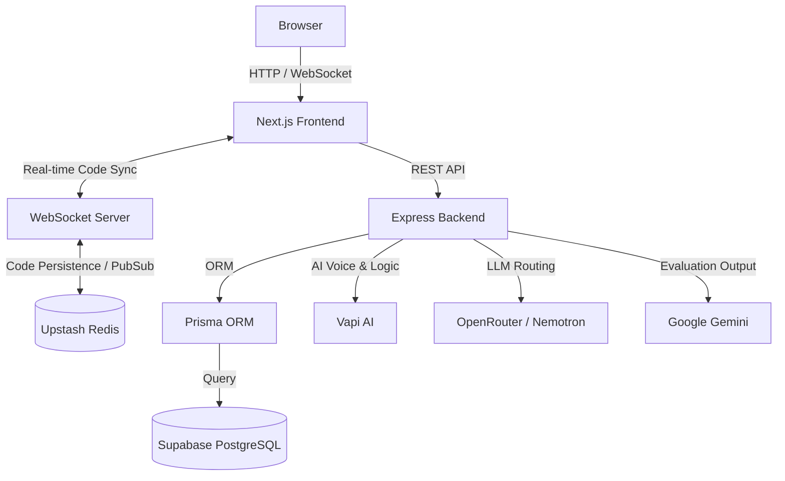

<h1 align="center">
  <br>
  
  <br>
  HireNext
  <br>
</h1>

<h4 align="center">AI-Powered Technical Interview Platform with Integrated Live Coding</h4>

<p align="center">
  <a href="#-overview">Overview</a> •
  <a href="#-features">Features</a> •
  <a href="#-architecture">Architecture</a> •
  <a href="#%EF%B8%8F-installation">Installation</a> •
  <a href="#-environment-variables">Configuration</a> •
  <a href="#-api-overview">API</a>
</p>

<p align="center">
  
  
  
  
  
  
  
  
</p>

---

## 🚀 Overview

**HireNext** is an advanced AI-powered technical interview platform designed to automate and elevate the first-round technical screening process. By seamlessly integrating an intelligent voice-based AI interviewer with a real-time, collaborative code editor, HireNext provides a realistic and rigorous interview experience without requiring engineering hours.

Candidates receive a secure, single-use link where they interact with an AI capable of asking dynamic questions, reviewing live code, and generating comprehensive feedback for hiring managers.

---

## ✨ Features

| Category | Features |
| :--- | :--- |
| **🎙️ AI Voice Interviews** | Natural, bidirectional voice conversations with an AI agent powered by **Vapi AI** and **Nemotron**. |
| **💻 Real-Time Coding** | Integrated **Monaco Editor** with syntax highlighting and autocompletion. |
| **⚡ Live Collaboration** | Sub-millisecond code synchronization using **WebSockets** and **Redis**. |
| **📊 Automated Feedback** | Comprehensive candidate evaluation, scoring, and feedback generated by **Gemini**. |
| **🔄 Dynamic Questioning** | AI adapts questions in real-time based on the candidate's performance and code. |
| **🔐 Secure & Scalable** | JWT authentication, rate limiting, and highly available architecture deployed on **Vercel** and **Render**. |

---

## 🏗 Architecture

HireNext utilizes a modern, decoupled client-server architecture optimized for low-latency real-time interactions.



### 🛠 Tech Stack

**Frontend:** Next.js 15 (App Router), React, Tailwind CSS, shadcn/ui, Monaco Editor, Zustand, SWR  
**Backend:** Express.js, Prisma ORM, PostgreSQL (Supabase), Redis (Upstash), WebSockets (ws)  
**AI Services:** Vapi AI, OpenRouter, Google Gemini, NVIDIA Nemotron  
**Deployment:** Vercel (Frontend), Render (Backend)  

---

## 📂 Folder Structure

```text
hirenext/
├── web/                    # Next.js 15 Frontend
│   ├── app/                # App Router (Pages & Layouts)
│   ├── components/         # Reusable UI & shadcn components
│   ├── lib/                # Zustand stores, SWR hooks, utilities
│   └── public/             # Static assets
├── backend/                # Express.js API & WebSocket Server
│   ├── src/
│   │   ├── controllers/    # Route logic
│   │   ├── routes/         # API endpoints
│   │   ├── services/       # AI & Business logic
│   │   └── sockets/        # WebSocket event handlers
│   └── prisma/             # Database schema & migrations
└── docs/                   # Additional documentation
```

---

## 📸 Screenshots

<div align="center">
  
  <p><em>Landing Page</em></p>
  
  
  <p><em>Admin Dashboard & Candidate Management</em></p>
  
  
  <p><em>Live Interview Environment & Monaco Coding Editor</em></p>
  
  
  <p><em>Automated AI Candidate Feedback & Analytics</em></p>
</div>

---

## 🛤 Interview Flow

```mermaid
graph LR
    A[Create Interview] --> B[Candidate Receives Link]
    B --> C[AI Voice Conversation]
    C --> D[Live Coding Round]
    D --> E[Interview Submission]
    E --> F[AI Evaluation Pipeline]
    F --> G[Feedback Dashboard]
    
    style A fill:#e2e8f0,stroke:#64748b,stroke-width:2px,color:#0f172a
    style G fill:#dcfce7,stroke:#22c55e,stroke-width:2px,color:#0f172a
```



---

## ⚙️ Installation

### Prerequisites

- [Node.js](https://nodejs.org/) (v18 or higher)
- [npm](https://www.npmjs.com/) or [yarn](https://yarnpkg.com/)
- [PostgreSQL](https://www.postgresql.org/) database
- [Redis](https://redis.io/) instance

### 1. Clone the Repository

```bash
git clone https://github.com/yourusername/hirenext.git
cd hirenext
```

### 2. Backend Setup

```bash
cd backend
npm install

# Generate Prisma Client
npx prisma generate

# Run database migrations
npx prisma migrate dev

# Start development server
npm run dev

# For Production
npm run build
npm start
```

### 3. Frontend Setup

```bash
cd ../web
npm install

# Start Next.js development server
npm run dev

# For Production
npm run build
npm start
```

---

## 🔐 Environment Variables

Create `.env` files in both `web/` and `backend/` directories.

### Frontend (`web/.env.local`)

| Variable | Description |
| :--- | :--- |
| `NEXT_PUBLIC_API_URL` | Backend REST API base URL |
| `NEXT_PUBLIC_WS_URL` | Backend WebSocket connection URL |
| `NEXT_PUBLIC_VAPI_KEY` | Public key for Vapi AI initialization |
| `NEXT_PUBLIC_GOOGLE_CLIENT_ID`| Google OAuth Client ID for authentication |

### Backend (`backend/.env`)

| Variable | Description |
| :--- | :--- |
| `PORT` | Server port (default: 5000) |
| `DATABASE_URL` | PostgreSQL connection string (Supabase) |
| `REDIS_URL` | Redis connection string (Upstash) |
| `JWT_SECRET` | Secret key for signing authentication tokens |
| `VAPI_PRIVATE_KEY` | Private key for server-side Vapi AI calls |
| `OPENROUTER_API_KEY` | API key for routing to Nemotron / LLMs |
| `GEMINI_API_KEY` | Google Gemini API key for evaluation |

> **Warning:** Never commit `.env` files to version control. Ensure they are included in your `.gitignore` and that no secrets are exposed to the client bundle.

---

## 🔌 API Overview

HireNext provides a robust RESTful API. Below are the primary namespaces:

- `POST /api/auth/*` - Google OAuth, JWT generation, and session management.
- `GET/POST /api/interviews/*` - CRUD operations for scheduling and managing interviews.
- `GET /api/feedback/*` - Retrieval of AI-generated feedback and scoring metrics.
- `GET /api/analytics/*` - Aggregated data for the admin dashboard.
- `POST /api/ai/evaluate` - Triggers the Gemini evaluation pipeline post-interview.

---

## 🚀 Performance & Security

### Performance Optimizations
- **WebSockets & Redis:** Real-time Monaco Editor synchronization is backed by Redis pub/sub and debounced to prevent network flooding.
- **Caching Strategy:** Extensive use of `SWR` on the frontend and Redis caching on the backend for frequently accessed data.
- **Code Splitting:** Next.js App Router automatically handles lazy loading and code splitting for optimal Time to Interactive (TTI).
- **Database:** Prisma optimized queries with strategic PostgreSQL indexing.

### Security Measures
- **Authentication:** Stateless JWT authentication with secure HTTP-only cookies.
- **Input Validation:** Strict payload validation using Zod before any database transaction.
- **Rate Limiting:** IP-based rate limiting on sensitive endpoints (authentication, AI generation) to prevent abuse.
- **Database Safety:** Prisma ORM inherently protects against SQL injection through parameterized queries. Secure environment variable injection.

---

## 🔮 Future Improvements

- [ ] **Video Integration:** WebRTC-based video feeds for candidates.
- [ ] **Multiplayer Mode:** Allow human interviewers to shadow or drop into the AI interview seamlessly.
- [ ] **Anti-Cheat & Proctoring:** Tab-switching detection and AI-based visual proctoring.
- [ ] **Virtual Whiteboard:** Integrated canvas for system design and architecture questions.
- [ ] **Multi-Language Support:** Expand code execution capabilities beyond JavaScript/TypeScript.
- [ ] **Company Branding:** Custom white-labeling options for enterprise clients.
- [ ] **Interview Recordings:** Secure playback of both code timeline and voice transcript.

---

## 🤝 Contributing

We welcome contributions to HireNext! Please follow these steps:

1. Fork the repository.
2. Create your feature branch (`git checkout -b feature/AmazingFeature`).
3. Commit your changes (`git commit -m 'Add some AmazingFeature'`).
4. Push to the branch (`git push origin feature/AmazingFeature`).
5. Open a Pull Request.

Please ensure your code follows the existing style conventions and passes all linting checks.

---

## 📄 License

Distributed under the MIT License. See `LICENSE` for more information.

---

## 📫 Contact

**Project Maintainer**  
[](https://github.com/yourusername) 
[](https://linkedin.com/in/yourprofile)  
📧 email@placeholder.com
